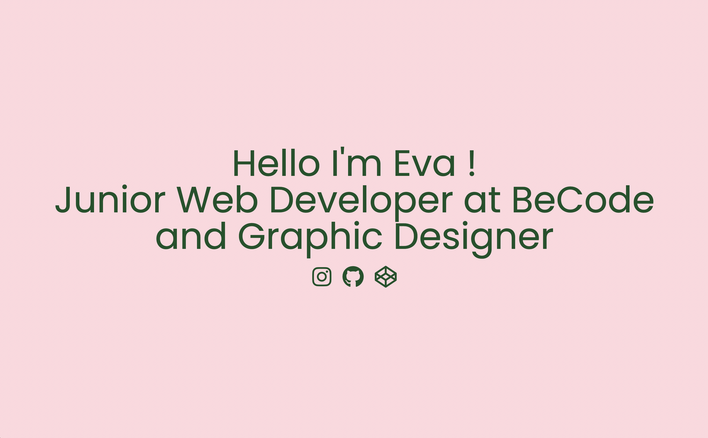

# 📜 LANDNG PAGE

## 🎯 OBJECTIFS

- Utiliser les médiaqueries pour créer une page responsive
- Continuer de se familiariser avec le Terminal, Git et Github

## 👉 CONSIGNES

- Rédigez notre landing page en HTML
- Styliser en CSS
- Utiliser les mediaqueries pour la rendre responsive
- Commiter and pusher via Terminal
- Déployer sur une page Github

## 🌐 LANGUAGE UTILISÉ

- Terminal
- Git & Github
- Html & Css
- Markdown

## ⏰ ÉTAT D'AVANCEMENT

- Finito 🙃

## 🔗 LIEN VERS LE PROJET

## 👀 APERÇU DU PROJET

